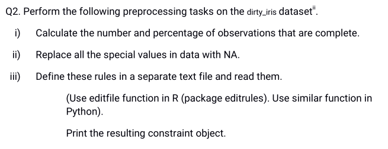
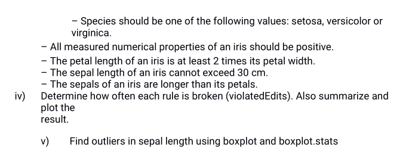

```{r setup, include=FALSE}
knitr::opts_chunk$set(echo = TRUE)
```

# Practical 1


```{r}
library(editrules)

df <- read.table("practical1/people.txt", header=TRUE)
attach(df)
E <- editset(expression(
  age >= 0,
  age <= 150,
  age >= yearsmarried,
  status %in% c("married", "single", "widowed"),
  if (age <= 18) agegroup %in% c("child"),
  if (age >= 19 && age <= 64) agegroup %in% c("adult"),
  if (age >= 65) agegroup %in% c("elderly")
))

sm <- violatedEdits(E, df)
summary(sm)
plot(sm)
```

# Practical 2




```{r}
library(editrules)

df <- read.csv("./practical2/dirty_iris.csv")
df.complete <- df[complete.cases(df), ]
print(paste(
  "Complete cases are: ",
  nrow(df.complete),
  " and their percentage: ",
  nrow(df.complete) / nrow(df) * 100,
  "%",
  sep = ""
))

attach(df.complete)

E <- editfile("practical2/rules.txt")

violations <- violatedEdits(E, df.complete)
summary(violations)
plot(violations)

boxplot(df.complete$Sepal.Length)
```

# Practical 3


```{r}
df <- read.csv(file = "practical3/wine.csv", sep = ";")

isNormalized <- function(df) {
  normalized <- TRUE
  for(i in 1:length(df)) {
    if (floor(mean(df[, i])) != 0 && sd(df[, i]) !=1) {
      normalized <- FALSE
    }
  }
  return(normalized)
}

normalizeTransformation <- function(x) {
  return ((x-mean(x))/sd(x))
}

if(isNormalized(df[, -12])) {
  cat("Dataset is normalized")
} else {
  cat("Dataset is not normalized")
  cat("\nNormalizing now")
  df.normalized <- data.frame(sapply(df[, -12], normalizeTransformation))
  df.normalized$quality <- df[, 12]
  if(isNormalized(df.normalized[, -12])) {
    cat("\nDataset is now normalized")
  } else {
    cat("\nNormalization failed")
  }
}
```

# Practical 4


```{r}
library(arules)
data(Adult)

rules <- apriori(Adult, parameter = list(supp = 0.5, conf = .75, target = "rules"))
summary(rules)
inspect(head(rules))
```

# Practical 5


```{r}
library(rpart)
library(caret)
library(e1071)
library(class)
data(iris)

#Holdout method
smp_size <- floor(0.75 * nrow(iris))
train <- iris[1:smp_size, ]
test <- iris[-(1:smp_size), ]

model <- naiveBayes(Species ~ ., data = train)
prediction <- predict(model, test)
confusionMatrix(prediction, test[,5])

model <- rpart(Species ~ ., data = train)
prediction <- predict(model, test, type = "class")
confusionMatrix(prediction, test[,5])

prediction = knn(train[,-5], test[,-5], factor(train[,5]), k = 10)
confusionMatrix(prediction, test[,5])
#Random Subsampling
smp_size <- floor(0.75 * nrow(iris))
set.seed(123)
train_ind <- sample(nrow(iris), size = smp_size)
train <- iris[train_ind, ]
test <- iris[-train_ind, ]

model <- naiveBayes(Species ~ ., data = train)
prediction <- predict(model, test)
confusionMatrix(prediction, test[,5])

model <- rpart(Species ~ ., data = train)
prediction <- predict(model, test, type = "class")
confusionMatrix(prediction, test[,5])

prediction = knn(train[,-5], test[,-5], factor(train[,5]), k = 10)
confusionMatrix(prediction, test[,5])

train_control <- trainControl(method="cv", number=10)
model <- train(Species~., data=iris, trControl=train_control, method="nb")
prediction <- predict(model, test)
confusionMatrix(prediction, test[,5])

train_control <- trainControl(method="cv", number=10)
model <- train(Species~., data=iris, trControl=train_control, method="rpart")
prediction <- predict(model, test)
confusionMatrix(prediction, test[,5])$table

train_control <- trainControl(method="cv", number=10)
model <- train(Species~., data=iris, trControl=train_control, method="knn")
prediction <- predict(model, test)
confusionMatrix(prediction, test[,5])
```

# Practical 6


```{r}
library(dbscan)
str(iris)

#kmeans
cl <- kmeans(iris[,-5], 3)
plot(iris[,-5], col = cl$cluster)
points(cl$centers, col = 1:3, pch = 8)


#heirarchical
clusters <- hclust(dist(iris[, -5]))
plot(clusters)

#DBScan
cl <- dbscan(iris[,-5], eps = .5, minPts = 5)
plot(iris[,-5], col = cl$cluster)
```